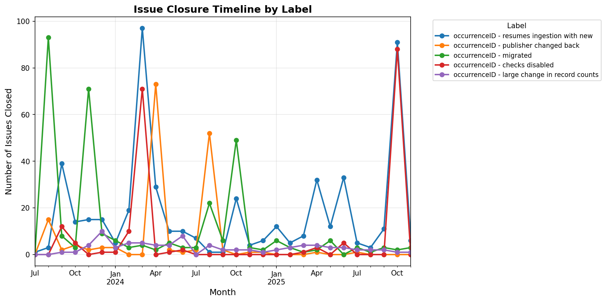
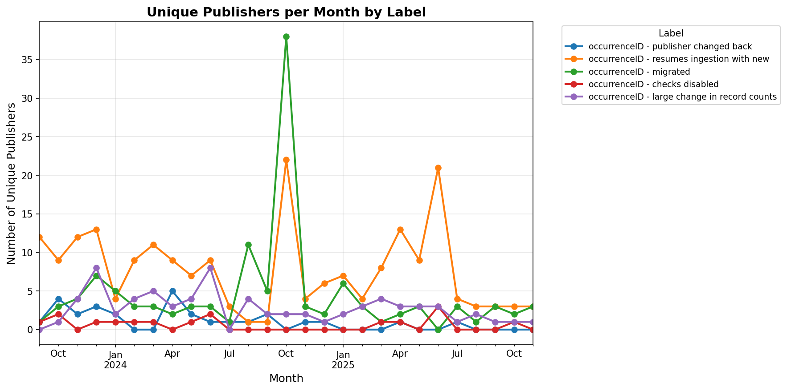

This repository is for tracking of data issues seen during data ingestion processes. It contains a number of issues automatically logged when dataset ingestions are paused.

The main issues detected and logged are change in occurrenceIDs. This is in order to improve occurrence stability: https://www.gbif.org/news/2M3n65fHOhvq4ek5oVOskc/new-processing-routine-improves-stability-of-gbif-occurrence-ids

For each issue:
 1. we check if there is any indication that the change was on purpose (we look for comments in the IPT or send an email to the data provider or technical contatcts or Node)
 2. if the change was on purpose and the data providers are able to provide us with a table of old and new occurrenceIDs, we can update those on GBIF's side (https://github.com/gbif/pipelines/tree/dev/gbif/identifiers/diagnostics)
 3. if the change was on purpose and there is no such table, we resume ingestion and new gbifid will be created
 4. if the change was accidental, we wait until the data provider rolls back the changes

See also this video for background information: https://vimeo.com/873639382

Last updated: 2025-11-21 13:27 UTC

### Closed Issues by Label

| Label | Closed Issues |
|-------|---------------|
| occurrenceID - publisher changed back | 165 |
| occurrenceID - resumes ingestion with new | 518 |
| occurrenceID - migrated | 322 |
| occurrenceID - checks disabled | 200 |
| occurrenceID - large change in record counts | 83 |

### Issue Closure Timeline

### Unique Publishers per Month

## Issue Statistics

Last updated: 2025-11-21 19:47 UTC

### Closed Issues by Label

| Label | Closed Issues |
|-------|---------------|
| occurrenceID - publisher changed back | 165 |
| occurrenceID - resumes ingestion with new | 518 |
| occurrenceID - migrated | 322 |
| occurrenceID - checks disabled | 200 |
| occurrenceID - large change in record counts | 83 |

### Issue Closure Timeline

### Unique Publishers per Month

